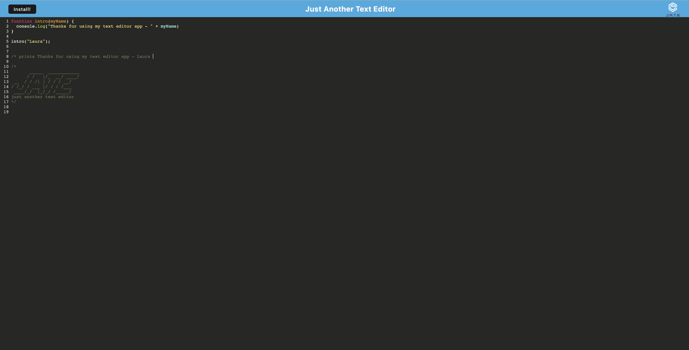

# Text-Editor-Application



## Table of Contents

This project is using the MIT license. 
    
- [Description](#description)
- [Installation](#installation)
- [Usage](#usage)
- [Credits](#credits)
- [License](#license)
- [Questions](#questions)

## Description
A text editor which uses Webpack and Service Workers to allow the user to download the application directly on their computer. Using coding syntax will change the color of the characters making it easier for the user to write readable code.  


## Installation
Clone repo locally onto computer, CD into directory and use
``` npm i && npm start ```
to see fully functioning.


## Usage
The user can type directly into the editor. When a JS function is created for example, the characters will change color depending on the part of the function it's at. The user can also click Install in top left corner to keep application saved locally. 

## Credits
This project was part of the Georgia Tech Full Stack Bootcamp Course

## License
MIT 


## Questions

If you have additional questions, you can reach me here:

[Github Profile](https://github.com/lauraantunez024)

My Email: Lauraantunez024@gmail.com

Link to deployed application or link to video to view:
https://lauras-text-editor.herokuapp.com/


